# 06 — Database Design

## 1. Purpose

This document defines the database design for the Store Management & Business Analytics System.

The database shall support:

* Product management
* Product categories and units
* Supplier management
* Customer account management
* Purchasing
* Sales
* Customer payments
* Supplier payments
* Inventory management
* Inventory adjustments
* Expense recording
* Transaction cancellation
* User and audit references
* Operational reporting
* Future analytical reporting

The database shall be implemented using **PostgreSQL** and accessed by the Django application through the Django ORM.

---

# 2. Database Design Principles

The database design follows these principles:

1. **Data integrity**

   * Relationships shall be enforced using foreign keys.
   * Required values shall be constrained at the database level where appropriate.
   * Invalid quantities and monetary values shall be prevented.

2. **Historical accuracy**

   * Completed transactions shall preserve the exact prices, costs, quantities, and participants that existed at the time of the transaction.
   * Changing a product's current price shall not change historical transactions.

3. **Transaction atomicity**

   * Operations that affect multiple related records shall be performed atomically.
   * A transaction shall either complete all required changes or none of them.

4. **Auditability**

   * Important business actions shall preserve user and timestamp information.
   * Completed transactions shall not be physically deleted.

5. **Controlled deletion**

   * Reference data shall normally be deactivated rather than physically deleted when historical records depend on it.

6. **Single source of truth**

   * The design shall avoid storing the same business fact in multiple places unless there is a clear consistency mechanism.

7. **V1 simplicity**

   * The database shall be sufficient for the initial single-store deployment without introducing unnecessary enterprise complexity.

8. **Future extensibility**

   * The design shall allow future features such as multiple stores, richer inventory history, barcode support, and additional reporting without requiring a complete redesign.

---

# 3. Database Technology

The production database shall use:

* **PostgreSQL**
* Accessed through **Django ORM**
* Database migrations managed by Django

Raw SQL may be used for specialized reporting or performance-critical analytical queries when appropriate.

PostgreSQL shall be the authoritative operational data store.

---

# 4. Conceptual Entity Model

The main entities are:

```text
Category
   │
   └──────< Product >────── Unit
                │
                ├──────< PurchaseItem >────── Purchase >──── Supplier
                │
                └──────< SaleItem >───────── Sale >──── Customer
                                                │
                                                └──── CustomerPayment

Supplier ──────< SupplierPayment

Product ───────< InventoryAdjustment

Expense

TransactionCancellation
        │
        ├──── Sale
        └──── Purchase

Django User
        │
        └──── references business actions
```

## 4.1 Entity Relationship Diagram

The following ERD represents the logical database structure for V1.

```mermaid
erDiagram

    CATEGORY ||--o{ PRODUCT : contains
    UNIT ||--o{ PRODUCT : measures

    SUPPLIER ||--o{ PURCHASE : provides
    PURCHASE ||--|{ PURCHASE_ITEM : contains
    PRODUCT ||--o{ PURCHASE_ITEM : included_in

    CUSTOMER o|--o{ SALE : makes
    SALE ||--|{ SALE_ITEM : contains
    PRODUCT ||--o{ SALE_ITEM : included_in

    CUSTOMER ||--o{ CUSTOMER_PAYMENT : makes
    SUPPLIER ||--o{ SUPPLIER_PAYMENT : receives

    PRODUCT ||--o{ INVENTORY_ADJUSTMENT : adjusted_by

    SALE ||--o| TRANSACTION_CANCELLATION : may_have
    PURCHASE ||--o| TRANSACTION_CANCELLATION : may_have

    AUTH_USER ||--o{ PURCHASE : creates
    AUTH_USER ||--o{ PURCHASE : completes
    AUTH_USER ||--o{ PURCHASE : cancels

    AUTH_USER ||--o{ SALE : creates
    AUTH_USER ||--o{ SALE : completes
    AUTH_USER ||--o{ SALE : cancels

    AUTH_USER ||--o{ CUSTOMER_PAYMENT : records
    AUTH_USER ||--o{ SUPPLIER_PAYMENT : records
    AUTH_USER ||--o{ INVENTORY_ADJUSTMENT : creates
    AUTH_USER ||--o{ EXPENSE : creates
    AUTH_USER ||--o{ TRANSACTION_CANCELLATION : performs


    CATEGORY {
        bigint id PK
        varchar name UK
        boolean is_active
        timestamp created_at
        timestamp updated_at
    }

    UNIT {
        bigint id PK
        varchar name UK
        varchar symbol UK
        boolean is_active
        timestamp created_at
        timestamp updated_at
    }

    PRODUCT {
        bigint id PK
        varchar name
        bigint category_id FK
        bigint unit_id FK
        numeric current_purchase_cost
        numeric current_sell_price
        numeric minimum_stock
        numeric current_stock
        boolean is_active
        timestamp created_at
        timestamp updated_at
    }

    SUPPLIER {
        bigint id PK
        varchar name
        varchar phone
        text contact_information
        boolean is_active
        timestamp created_at
        timestamp updated_at
    }

    CUSTOMER {
        bigint id PK
        varchar name
        varchar phone
        text contact_information
        varchar account_status
        timestamp created_at
        timestamp updated_at
    }

    PURCHASE {
        bigint id PK
        varchar reference UK
        bigint supplier_id FK
        varchar payment_type
        varchar status
        numeric total_amount
        timestamp created_at
        bigint created_by_id FK
        timestamp completed_at
        bigint completed_by_id FK
        timestamp cancelled_at
        bigint cancelled_by_id FK
    }

    PURCHASE_ITEM {
        bigint id PK
        bigint purchase_id FK
        bigint product_id FK
        numeric quantity
        numeric unit_cost
        numeric line_total
    }

    SALE {
    bigint id PK
    varchar reference UK
    bigint customer_id FK
    varchar payment_type
    varchar status
    numeric subtotal_amount
    numeric discount_amount
    numeric total_amount
    timestamp created_at
    bigint created_by_id FK
    timestamp completed_at
    bigint completed_by_id FK
    timestamp cancelled_at
    bigint cancelled_by_id FK
    }  
    SALE_ITEM {
        bigint id PK
        bigint sale_id FK
        bigint product_id FK
        numeric quantity
        numeric unit_price
        numeric line_total
    }

    CUSTOMER_PAYMENT {
        bigint id PK
        varchar reference UK
        bigint customer_id FK
        numeric amount
        varchar payment_method
        timestamp payment_date
        text note
        bigint recorded_by_id FK
        timestamp created_at
    }

    SUPPLIER_PAYMENT {
        bigint id PK
        varchar reference UK
        bigint supplier_id FK
        numeric amount
        varchar payment_method
        timestamp payment_date
        text note
        bigint recorded_by_id FK
        timestamp created_at
    }

    INVENTORY_ADJUSTMENT {
        bigint id PK
        varchar reference UK
        bigint product_id FK
        varchar adjustment_type
        numeric quantity
        text reason
        timestamp created_at
        bigint created_by_id FK
    }

    EXPENSE {
        bigint id PK
        varchar reference UK
        varchar category
        numeric amount
        varchar payment_method
        date expense_date
        text description
        timestamp created_at
        bigint created_by_id FK
    }

    TRANSACTION_CANCELLATION {
        bigint id PK
        bigint sale_id FK
        bigint purchase_id FK
        text reason
        timestamp cancelled_at
        bigint cancelled_by_id FK
    }

    AUTH_USER {
        bigint id PK
    }
```



---

# 5. Entity Relationships

## 5.1 Category → Product

One category can contain many products.

```text
Category 1 ───────< Product
```

A product shall belong to one active category.

A category may not be physically deleted when products reference it.

---

## 5.2 Unit → Product

One unit can be associated with many products.

```text
Unit 1 ───────< Product
```

Examples:

* kg
* g
* piece
* box
* tray

A unit may not be physically deleted when referenced by products or historical transactions.

---

## 5.3 Product → PurchaseItem

One product can appear in many purchase items.

```text
Product 1 ───────< PurchaseItem
```

Each purchase item stores the actual unit cost used for that purchase.

---

## 5.4 Product → SaleItem

One product can appear in many sale items.

```text
Product 1 ───────< SaleItem
```

Each sale item stores the actual selling price used for that sale.

---

## 5.5 Supplier → Purchase

One supplier can have many purchases.

```text
Supplier 1 ───────< Purchase
```

A purchase must reference a supplier.

---

## 5.6 Customer → Sale

A customer may have many sales.

```text
Customer 1 ───────< Sale
```

However, the relationship is optional because cash walk-in customers do not require customer accounts.

```text
Sale.customer_id → nullable
```

Rules:

* Cash sale → customer may be NULL.
* Credit sale → customer is required.

---

## 5.7 Customer → CustomerPayment

A customer can make many payments.

```text
Customer 1 ───────< CustomerPayment
```

Customer payments settle previously created customer receivables.

A customer payment does not modify the original sale.

---

## 5.8 Supplier → SupplierPayment

A supplier can have many payments.

```text
Supplier 1 ───────< SupplierPayment
```

Supplier payments settle previously created supplier payables.

A supplier payment does not modify the original purchase.

---

## 5.9 Product → InventoryAdjustment

A product can have many inventory adjustments.

```text
Product 1 ───────< InventoryAdjustment
```

Adjustments represent manual corrections to operational stock.


---

# 6. Category

## Purpose

Stores the categories used to classify products.

## Fields

| Field      | Type      | Constraints            |
| ---------- | --------- | ---------------------- |
| id         | BIGINT    | Primary Key            |
| name       | VARCHAR   | Required, unique       |
| is_active  | BOOLEAN   | Required, default TRUE |
| created_at | TIMESTAMP | Required               |
| updated_at | TIMESTAMP | Required               |

## Examples

* Nuts
* Coffee
* Chocolate
* Sweets
* Dried Fruits
* Dates
* Gift Boxes
* Hospitality Trays

## Rules

* Category names shall be unique.
* Categories may be deactivated.
* Inactive categories shall not be selectable for new products.
* Existing products and historical records shall retain their category references.

---

# 7. Unit

## Purpose

Stores units of measurement used by products.

## Fields

| Field      | Type      | Constraints            |
| ---------- | --------- | ---------------------- |
| id         | BIGINT    | Primary Key            |
| name       | VARCHAR   | Required, unique       |
| symbol     | VARCHAR   | Required, unique       |
| is_active  | BOOLEAN   | Required, default TRUE |
| created_at | TIMESTAMP | Required               |
| updated_at | TIMESTAMP | Required               |

## Examples

| Name     | Symbol |
| -------- | ------ |
| Kilogram | kg     |
| Gram     | g      |
| Piece    | pcs    |
| Box      | box    |
| Tray     | tray   |

## Rules

* Unit names and symbols shall be unique.
* Units may be deactivated.
* Inactive units shall not be selectable for new products.
* Historical records shall retain their references.

---

# 8. Product

## Purpose

Stores the master information and current operational state of products.

## Fields

| Field                 | Type          | Constraints               |
| --------------------- | ------------- | ------------------------- |
| id                    | BIGINT        | Primary Key               |
| name                  | VARCHAR       | Required                  |
| category_id           | BIGINT        | FK → Category             |
| unit_id               | BIGINT        | FK → Unit                 |
| current_purchase_cost | NUMERIC(12,3) | Required, >= 0            |
| current_sell_price    | NUMERIC(12,3) | Required, >= 0            |
| minimum_stock         | NUMERIC(12,3) | Required, >= 0            |
| current_stock         | NUMERIC(12,3) | Required, default 0, >= 0 |
| is_active             | BOOLEAN       | Required, default TRUE    |
| created_at            | TIMESTAMP     | Required                  |
| updated_at            | TIMESTAMP     | Required                  |

## Current Pricing

`current_purchase_cost` represents the current/default purchase cost.

`current_sell_price` represents the current/default selling price.

These values are used as defaults when creating new transactions.

They do not represent historical transaction prices.

## Current Stock

`current_stock` represents the current operational quantity available for the product.

It is updated only by:

* Completed purchases
* Completed sales
* Inventory adjustments
* Transaction cancellations

Draft transactions shall not affect `current_stock`.

## Rules

* Product name shall be required.
* Category and unit shall reference active records when creating or updating a product.
* Prices cannot be negative.
* Minimum stock cannot be negative.
* Current stock cannot be negative.
* Inactive products cannot be added to new transactions.
* Historical transaction records shall not depend on the current product price.

---

# 9. Supplier

## Purpose

Stores suppliers from whom products are purchased.

## Fields

| Field               | Type      | Constraints            |
| ------------------- | --------- | ---------------------- |
| id                  | BIGINT    | Primary Key            |
| name                | VARCHAR   | Required               |
| phone               | VARCHAR   | Optional               |
| contact_information | TEXT      | Optional               |
| is_active           | BOOLEAN   | Required, default TRUE |
| created_at          | TIMESTAMP | Required               |
| updated_at          | TIMESTAMP | Required               |

## Rules

* Supplier name is required.
* Suppliers may be deactivated.
* Historical purchases shall retain their supplier references.
* An inactive supplier shall not be selectable for new purchases.

Supplier outstanding balance shall **not** be stored as a duplicated field.

It shall be calculated from completed credit purchases and supplier payments.

---

# 10. Customer

## Purpose

Stores customers whose accounts need to be tracked.

A customer record is primarily required when the customer purchases on credit or otherwise requires an account balance/history.

## Fields

| Field               | Type      | Constraints |
| ------------------- | --------- | ----------- |
| id                  | BIGINT    | Primary Key |
| name                | VARCHAR   | Required    |
| phone               | VARCHAR   | Optional    |
| contact_information | TEXT      | Optional    |
| account_status      | VARCHAR   | Required    |
| created_at          | TIMESTAMP | Required    |
| updated_at          | TIMESTAMP | Required    |

## Rules

* Cash walk-in customers do not require customer records.
* Credit sales require a customer.
* Customers may have multiple credit sales and payments.
* Customer outstanding balance shall not be stored as a duplicated balance field.
* Outstanding balance shall be calculated from completed credit sales and customer payments.
* Customer history shall remain available even when the account is inactive.

---

# 11. Purchase

## Purpose

Represents a purchase transaction from a supplier.

## Fields

| Field           | Type          | Constraints                             |
| --------------- | ------------- | --------------------------------------- |
| id              | BIGINT        | Primary Key                             |
| reference       | VARCHAR       | Required, unique                        |
| supplier_id     | BIGINT        | FK → Supplier                           |
| payment_type    | VARCHAR       | Required: CASH / CREDIT                 |
| status          | VARCHAR       | Required: DRAFT / COMPLETED / CANCELLED |
| total_amount    | NUMERIC(14,3) | Required, >= 0                          |
| created_at      | TIMESTAMP     | Required                                |
| created_by_id   | BIGINT        | FK → Django User                        |
| completed_at    | TIMESTAMP     | Nullable                                |
| completed_by_id | BIGINT        | FK → Django User, nullable              |
| cancelled_at    | TIMESTAMP     | Nullable                                |
| cancelled_by_id | BIGINT        | FK → Django User, nullable              |

## Rules

* A purchase starts as `DRAFT`.
* Draft purchases do not affect inventory or financial balances.
* A completed purchase increases inventory.
* A cash purchase represents an immediately paid purchase.
* A credit purchase creates a supplier payable.
* Completed purchases cannot be edited or deleted.
* A completed purchase may be cancelled by an authorized user.
* A cancelled purchase remains stored.

---

# 12. PurchaseItem

## Purpose

Stores individual products included in a purchase.

## Fields

| Field       | Type          | Constraints    |
| ----------- | ------------- | -------------- |
| id          | BIGINT        | Primary Key    |
| purchase_id | BIGINT        | FK → Purchase  |
| product_id  | BIGINT        | FK → Product   |
| quantity    | NUMERIC(12,3) | Required, > 0  |
| unit_cost   | NUMERIC(12,3) | Required, >= 0 |
| line_total  | NUMERIC(14,3) | Required, >= 0 |

## Pricing Rule

When a purchase is created:

```text
Product.current_purchase_cost
        ↓
default PurchaseItem.unit_cost
```

The user may override the unit cost if the supplier's actual invoice price differs.

Example:

```text
Current product cost: $18/kg
Supplier invoice:     $20/kg

PurchaseItem.unit_cost = $20
```

The system shall **not automatically change** the product's current default purchase cost.

Updating the product's default cost is a separate product-management action.

## Historical Rule

`unit_cost` is the actual cost used in that transaction and must remain unchanged after completion.

---

# 13. Sale

## Purpose

Represents a customer sale.

## Fields

| Field           | Type          | Constraints                             |
| --------------- | ------------- | --------------------------------------- |
| id              | BIGINT        | Primary Key                             |
| reference       | VARCHAR       | Required, unique                        |
| customer_id     | BIGINT        | FK → Customer, nullable                 |
| payment_type    | VARCHAR       | Required: CASH / CREDIT                 |
| status          | VARCHAR       | Required: DRAFT / COMPLETED / CANCELLED |
| subtotal_amount | NUMERIC(14,3) | Required, >= 0 |
| discount_amount | NUMERIC(14,3) | Required, default 0, >= 0 |
| total_amount    | NUMERIC(14,3) | Required, >= 0                          |
| created_at      | TIMESTAMP     | Required                                |
| created_by_id   | BIGINT        | FK → Django User                        |
| completed_at    | TIMESTAMP     | Nullable                                |
| completed_by_id | BIGINT        | FK → Django User, nullable              |
| cancelled_at    | TIMESTAMP     | Nullable                                |
| cancelled_by_id | BIGINT        | FK → Django User, nullable              |

## Rules

### Cash Sale

```text
customer_id = NULL or customer record if desired
payment_type = CASH
```

A cash customer does not require a customer account.

### Credit Sale

```text
customer_id IS NOT NULL
payment_type = CREDIT
```

A credit sale creates a customer receivable when completed.

### Lifecycle

```text
DRAFT → COMPLETED → CANCELLED
```

Draft sales do not affect inventory or customer balances.

Completed sales:

* decrease inventory
* represent revenue
* create a customer receivable when credit
* represent immediate payment when cash

Completed sales cannot be edited or deleted.


### Sale Discount

Discounts are applied at the sale level in V1.

The `Sale` entity stores:

- `subtotal_amount`
- `discount_amount`
- `total_amount`

The subtotal is calculated from the sale items:

```text
subtotal_amount =
Σ(SaleItem.quantity × SaleItem.unit_price)
```
total_amount =
subtotal_amount - discount_amount
---

# 14. SaleItem

## Purpose

Stores individual products included in a sale.

## Fields

| Field      | Type          | Constraints    |
| ---------- | ------------- | -------------- |
| id         | BIGINT        | Primary Key    |
| sale_id    | BIGINT        | FK → Sale      |
| product_id | BIGINT        | FK → Product   |
| quantity   | NUMERIC(12,3) | Required, > 0  |
| unit_price | NUMERIC(12,3) | Required, >= 0 |
| line_total | NUMERIC(14,3) | Required, >= 0 |

## Pricing Rule

When a sale is created:

```text
Product.current_sell_price
        ↓
default SaleItem.unit_price
```

The sale stores the actual unit price used.

If the product price later changes, the historical sale does not change.

Example:

```text
Monday:
Product price = $25
SaleItem.unit_price = $25

Tuesday:
Product price = $27
SaleItem.unit_price for new sales = $27

Monday sale remains $25.
```

---
## Discount Rule

V1 discounts are stored at the `Sale` level rather than at the `SaleItem` level.

`SaleItem.unit_price` represents the actual selling price before the sale-level discount.

The discount shall not modify `SaleItem.unit_price` or `SaleItem.line_total`.

This preserves the original pricing of each product within the transaction.

No `discount_amount` field is required on `SaleItem` in V1.

---

# 15. CustomerPayment

## Purpose

Records payments made by customers against existing outstanding credit balances.

## Fields

| Field          | Type          | Constraints      |
| -------------- | ------------- | ---------------- |
| id             | BIGINT        | Primary Key      |
| reference      | VARCHAR       | Required, unique |
| customer_id    | BIGINT        | FK → Customer    |
| amount         | NUMERIC(14,3) | Required, > 0    |
| payment_method | VARCHAR       | Required         |
| payment_date   | TIMESTAMP     | Required         |
| note           | TEXT          | Optional         |
| recorded_by_id | BIGINT        | FK → Django User |
| created_at     | TIMESTAMP     | Required         |

## Rules

* A customer payment reduces outstanding customer debt.
* The original sale shall not be modified.
* Payments shall remain stored for auditability.
* V1 shall not allow payments greater than the customer's outstanding balance unless overpayment support is explicitly added later.
* A payment shall reference an existing customer account.

---

# 16. SupplierPayment

## Purpose

Records payments made to suppliers against outstanding supplier payables.

## Fields

| Field          | Type          | Constraints      |
| -------------- | ------------- | ---------------- |
| id             | BIGINT        | Primary Key      |
| reference      | VARCHAR       | Required, unique |
| supplier_id    | BIGINT        | FK → Supplier    |
| amount         | NUMERIC(14,3) | Required, > 0    |
| payment_method | VARCHAR       | Required         |
| payment_date   | TIMESTAMP     | Required         |
| note           | TEXT          | Optional         |
| recorded_by_id | BIGINT        | FK → Django User |
| created_at     | TIMESTAMP     | Required         |

## Rules

* A supplier payment reduces outstanding supplier debt.
* The original purchase shall not be modified.
* Payments remain stored for auditability.
* V1 shall not allow payments greater than the supplier's outstanding balance unless overpayment support is explicitly introduced.

---

# 17. InventoryAdjustment

## Purpose

Records manual corrections to product stock.

Inventory adjustments are used for discrepancies that are **not caused by transaction cancellation**.

Examples:

* Physical stock count differs from system quantity.
* Damaged goods.
* Spoilage.
* Missing goods.
* Data-entry correction.

## Fields

| Field           | Type          | Constraints                   |
| --------------- | ------------- | ----------------------------- |
| id              | BIGINT        | Primary Key                   |
| reference       | VARCHAR       | Required, unique              |
| product_id      | BIGINT        | FK → Product                  |
| adjustment_type | VARCHAR       | Required: INCREASE / DECREASE |
| quantity        | NUMERIC(12,3) | Required, > 0                 |
| reason          | TEXT          | Required                      |
| created_at      | TIMESTAMP     | Required                      |
| created_by_id   | BIGINT        | FK → Django User              |

## Rules

* Every adjustment requires a reason.
* An inventory decrease cannot result in negative stock.
* Adjustments update `Product.current_stock`.
* Adjustments do not modify historical purchases or sales.
* Adjustments remain permanently recorded.

---

# 18. Expense

## Purpose

Records business expenses that are not product purchases.

Examples:

* Electricity
* Rent
* Maintenance
* Transportation
* Supplies
* Other operating expenses

## Fields

| Field          | Type          | Constraints      |
| -------------- | ------------- | ---------------- |
| id             | BIGINT        | Primary Key      |
| reference      | VARCHAR       | Required, unique |
| category       | VARCHAR       | Required         |
| amount         | NUMERIC(14,3) | Required, > 0    |
| payment_method | VARCHAR       | Required         |
| expense_date   | DATE          | Required         |
| description    | TEXT          | Optional         |
| created_at     | TIMESTAMP     | Required         |
| created_by_id  | BIGINT        | FK → Django User |

## Rules

* Expenses do not affect product inventory.
* `expense_date` represents the business date of the expense.
* `created_at` represents when the record was entered into the system.
* Expenses cannot have a negative amount.

---

# 19. TransactionCancellation

## Purpose

Records the cancellation of a completed sale or purchase.

Cancellation is **not a product return**.

The system does not support sale returns or purchase returns in V1.

## Fields

| Field           | Type      | Constraints             |
| --------------- | --------- | ----------------------- |
| id              | BIGINT    | Primary Key             |
| sale_id         | BIGINT    | FK → Sale, nullable     |
| purchase_id     | BIGINT    | FK → Purchase, nullable |
| reason          | TEXT      | Required                |
| cancelled_at    | TIMESTAMP | Required                |
| cancelled_by_id | BIGINT    | FK → Django User        |

## Relationship Rule

Exactly one of the following must be populated:

```text
sale_id
OR
purchase_id
```

Never both.

This gives the database real foreign-key enforcement instead of using:

```text
transaction_type
transaction_id
```

which would not provide a true database-level foreign key.

Each sale or purchase may have at most one cancellation record.

## Cancellation Effects

### Cancelled Sale

Reverse:

* Inventory decrease
* Cash/payment effect if applicable
* Customer receivable if credit

The original sale remains stored.

### Cancelled Purchase

Reverse:

* Inventory increase
* Supplier payable if credit
* Cash/payment effect if applicable

The original purchase remains stored.

---

# 20. User and Audit References

The application shall use Django's built-in authentication system.

Business records shall reference the Django User where the user responsible for an action needs to be preserved.

Examples:

* `created_by_id`
* `completed_by_id`
* `cancelled_by_id`
* `recorded_by_id`

The system shall not duplicate Django's authentication data in a separate user table.

Roles and permissions shall be implemented using Django authentication, groups, and permissions.

Initial roles:

* Owner
* Cashier
* Administrator

The exact permission matrix shall be defined during implementation.

---

# 21. Transaction Status Model

Sales and purchases use the following lifecycle:

```text
DRAFT
   │
   ▼
COMPLETED
   │
   ▼
CANCELLED
```

## DRAFT

A draft transaction:

* Can be edited.
* Can be abandoned or deleted according to application rules.
* Does not affect inventory.
* Does not affect customer/supplier balances.
* Is not included in completed sales/purchase reports.

## COMPLETED

A completed transaction:

* Cannot normally be edited.
* Cannot be physically deleted.
* Affects inventory.
* Affects financial state.
* Is included in operational reports.
* May be cancelled by an authorized user.

## CANCELLED

A cancelled transaction:

* Cannot be edited.
* Cannot be completed again.
* Remains in the database.
* Preserves its original information.
* Has cancellation information.
* Reverses its applicable business effects.
* Is excluded from normal completed-transaction reports.

---

# 22. Inventory Data Model

V1 shall use:

```text
Product.current_stock
```

as the operational source of truth for current inventory.

## Inventory Effects

| Event              |                  Stock Effect |
| ------------------ | ----------------------------: |
| Draft Purchase     |                             0 |
| Completed Purchase |                    + quantity |
| Draft Sale         |                             0 |
| Completed Sale     |                    - quantity |
| Inventory Increase |                    + quantity |
| Inventory Decrease |                    - quantity |
| Cancelled Purchase | - original purchased quantity |
| Cancelled Sale     |      + original sold quantity |

All stock-changing operations shall occur inside database transactions.

## Concurrency

When completing a sale, the application shall verify sufficient stock and update the relevant product stock atomically.

The implementation should use appropriate database row locking where necessary to prevent concurrent sales from producing negative stock.

## Future Inventory Ledger

A dedicated immutable `InventoryMovement` ledger is intentionally **not required for V1**.

If future requirements demand detailed movement-level inventory reporting, warehouse tracking, or more advanced stock auditing, an inventory ledger can be introduced without changing the existing purchase, sale, and adjustment entities.

---

# 23. Financial Balance Model

Customer and supplier balances shall be calculated rather than duplicated as stored balance fields.

This prevents multiple sources of truth.

## Customer Balance

Conceptually:

```text
Customer Outstanding Balance
=
Completed Credit Sales
-
Customer Payments
```

Cancelled credit sales shall no longer contribute to the outstanding balance.

## Supplier Balance

Conceptually:

```text
Supplier Outstanding Balance
=
Completed Credit Purchases
-
Supplier Payments
```

Cancelled credit purchases shall no longer contribute to the outstanding balance.

## Important Rule

Payments do not modify the original sale or purchase.

Example:

```text
Credit Sale = $100

Customer balance = $100

Customer Payment = $30

Customer balance = $70
```

The original sale remains `$100`.

---

# 24. Data Integrity Constraints

The database shall enforce appropriate constraints.

## Quantity

```text
quantity > 0
```

## Prices and Costs

```text
current_purchase_cost >= 0
current_sell_price >= 0
unit_cost >= 0
unit_price >= 0
```

## Monetary Amounts

```text
amount > 0


subtotal_amount >= 0

discount_amount >= 0

discount_amount <= subtotal_amount

total_amount >= 0

total_amount = subtotal_amount - discount_amount
```
The database/application layer shall ensure that a sale discount cannot exceed the sale subtotal.

A sale shall not have a negative final total.
## Stock

```text
current_stock >= 0
minimum_stock >= 0
```

## Payment Type

Purchase and Sale payment type shall be restricted to:

```text
CASH
CREDIT
```

## Transaction Status

Purchase and Sale status shall be restricted to:

```text
DRAFT
COMPLETED
CANCELLED
```

## Cancellation

Exactly one of:

```text
sale_id
purchase_id
```

must be populated.

---

# 25. Delete Strategy

## Reference Data

Categories, units, products, suppliers, and customers shall generally use deactivation rather than physical deletion when historical records depend on them.

Example:

```text
is_active = FALSE
```

## Completed Transactions

Completed sales and purchases shall never be physically deleted through normal application functionality.

## Cancelled Transactions

Cancelled transactions shall never be physically deleted through normal application functionality.

## Payments

Recorded customer and supplier payments shall remain stored for auditability.

If a payment correction mechanism is required later, it should use a controlled reversal/adjustment mechanism rather than silently deleting the original payment.

---

# 26. Indexing Strategy

Indexes shall be created for fields frequently used in:

* Foreign-key lookups
* Transaction searches
* Reporting filters
* Customer/supplier account queries
* Product searches

Important indexes include:

```text
Product.category_id
Product.unit_id

Purchase.supplier_id
Purchase.status
Purchase.created_at

PurchaseItem.purchase_id
PurchaseItem.product_id

Sale.customer_id
Sale.status
Sale.created_at

SaleItem.sale_id
SaleItem.product_id

CustomerPayment.customer_id
CustomerPayment.payment_date

SupplierPayment.supplier_id
SupplierPayment.payment_date

InventoryAdjustment.product_id
InventoryAdjustment.created_at
```

Unique indexes shall exist for:

```text
Category.name
Unit.name
Unit.symbol
Purchase.reference
Sale.reference
CustomerPayment.reference
SupplierPayment.reference
InventoryAdjustment.reference
Expense.reference
```

The final Django migration shall create indexes appropriate to the actual query patterns identified during implementation.

---

# 27. Date and Time Fields

The database shall distinguish between different types of dates/times where required.

Examples:

```text
created_at
updated_at
completed_at
cancelled_at
payment_date
expense_date
```

The meanings are:

* `created_at` — when the record was created.
* `updated_at` — when the record was last modified.
* `completed_at` — when a transaction became completed.
* `cancelled_at` — when a transaction was cancelled.
* `payment_date` — business date/time associated with a payment.
* `expense_date` — business date associated with an expense.

The exact PostgreSQL timestamp configuration shall be finalized during implementation.

---

# 28. Transaction Atomicity

Operations that modify multiple related records shall use database transactions.

## Completing a Sale

Conceptually:

```text
BEGIN

Validate sale
Validate products
Validate stock
Update inventory
Create financial effect
Change status to COMPLETED
Record completion information

COMMIT
```

If any step fails:

```text
ROLLBACK
```

No partial sale shall remain.

## Completing a Purchase

Conceptually:

```text
BEGIN

Validate purchase
Update inventory
Create financial effect
Change status to COMPLETED
Record completion information

COMMIT
```

If any step fails:

```text
ROLLBACK
```

## Cancellation

Cancellation shall also be atomic.

The original transaction status and all reversed effects must be updated consistently.

---

# 29. Concurrency and Consistency

Although V1 is intended primarily for a single laptop, the architecture shall not assume that only one request can ever occur at a time.

Inventory-changing operations shall be protected against race conditions.

For example, when completing a sale:

```text
Read current stock
        ↓
Lock product row
        ↓
Verify sufficient stock
        ↓
Decrease stock
        ↓
Complete sale
        ↓
Commit
```

This prevents two simultaneous transactions from consuming the same stock.

---

# 30. Reporting Data

Operational reports shall query the normalized operational database.

Examples:

### Sales Reports

* Total sales
* Number of completed sales
* Quantity sold
* Sales by product
* Sales by category
* Sales by payment type
* Sales by customer
* Sales trends

### Inventory Reports

* Current stock
* Low-stock products
* Out-of-stock products
* Stock by category
* Purchase quantities
* Sales quantities
* Inventory adjustments

### Financial Reports

* Customer outstanding balances
* Supplier outstanding balances
* Customer payments
* Supplier payments
* Expenses
* Cash vs credit activity

Draft transactions shall not be treated as completed business activity.

Cancelled transactions shall normally be excluded from completed operational metrics while remaining available for audit and cancellation analysis.

---

# 31. Auditability

The system shall preserve enough information to determine:

* What was created
* Who created it
* When it was created
* Who completed it
* When it was completed
* Who cancelled it
* When it was cancelled
* Why it was cancelled
* Which prices/costs were used
* Which quantities were involved

Historical transaction items shall preserve the actual unit price or cost used at the time of the transaction.

The system shall never rewrite historical transaction prices merely because current product pricing changes.

---

# 32. Product Price History

The current product price is stored on `Product`.

Historical transaction prices are stored on:

```text
SaleItem.unit_price
PurchaseItem.unit_cost
```

This is sufficient to preserve transaction history.

A separate price-history table is **not required for V1** unless the business specifically requires an audit trail of every product price change.

If required later, a dedicated entity can be introduced:

```text
ProductPriceHistory
-------------------
id
product_id
price_type
old_value
new_value
effective_at
changed_by_id
```

This is intentionally outside the required V1 schema.

---

# 33. Naming Conventions

Database naming shall follow consistent English naming conventions.

Examples:

```text
current_sell_price
current_purchase_cost
minimum_stock
created_at
completed_at
cancelled_at
created_by_id
completed_by_id
cancelled_by_id
```

Database identifiers shall remain in English.

Arabic shall be used in the user-facing interface, not in database identifiers.

---

# 34. Arabic Interface and Database Separation

The database shall not depend on Arabic interface labels.

For example:

```text
Database:
current_sell_price

UI:
سعر البيع الحالي
```

Similarly:

```text
Database:
minimum_stock

UI:
الحد الأدنى للمخزون
```

This separation allows the application to support additional languages in the future without restructuring the database.

---

# 35. V1 Scope Boundaries

The following are explicitly outside the V1 database scope:

* Product returns
* Purchase returns
* Sale refunds caused by returns
* Multi-store operational data
* Warehouse management
* Barcode infrastructure
* Advanced inventory movement ledger
* Customer credit limits
* Supplier credit limits
* Complex accounting/GL
* Tax accounting
* Automated price history
* Online/cloud synchronization
* Mobile-specific data models

These may be considered in future versions if business requirements justify them.

---

# 36. Future Multi-Store Support

V1 is designed for a single store.

A future multi-store version may introduce entities such as:

```text
Store
```

and associate operational records with a store:

```text
Product
Purchase
Sale
Inventory
Expense
User
```

The V1 database shall therefore avoid assumptions that make future store identification impossible.

However, multi-tenancy or multi-store infrastructure shall **not** be implemented prematurely in V1.

---

# 37. Final Table Summary

| Entity                  | Purpose                                             |
| ----------------------- | --------------------------------------------------- |
| Category                | Product classification                              |
| Unit                    | Product measurement unit                            |
| Product                 | Product master data and current stock/pricing       |
| Supplier                | Supplier information                                |
| Customer                | Account-tracked customer information                |
| Purchase                | Purchase transaction                                |
| PurchaseItem            | Products within purchases                           |
| Sale                    | Sale transaction, totals, and sale-level discount   |
| SaleItem                | Products within sales                               |
| CustomerPayment         | Payments against customer debt                      |
| SupplierPayment         | Payments against supplier debt                      |
| InventoryAdjustment     | Manual inventory correction                         |
| Expense                 | Operating expenses                                  |
| TransactionCancellation | Cancellation of completed sale/purchase             |
| Django User             | Authentication, authorization, and audit references |

---

# 38. Logical Relationship Summary

```text
Category
   │
   └──────< Product >────── Unit
                │
                ├──────< PurchaseItem >────── Purchase >──── Supplier
                │
                └──────< SaleItem >───────── Sale >──── Customer
                                                         │
                                                         └──< CustomerPayment

Supplier ──────< SupplierPayment

Product ───────< InventoryAdjustment

Django User ────< Business Actions

Sale ─────────── TransactionCancellation
Purchase ─────── TransactionCancellation

Expense ───────── Django User
```

---

# 39. Database Validation Checklist

Before implementation, the database design shall satisfy the following:

* [x] Products have categories.
* [x] Products have units.
* [x] Products store current/default purchase cost.
* [x] Products store current/default selling price.
* [x] Products store current stock.
* [x] Historical sale prices are preserved.
* [x] Historical purchase costs are preserved.
* [x] Cash customers do not require customer accounts.
* [x] Credit sales require customers.
* [x] Credit purchases require suppliers.
* [x] Customer payments are separate from original sales.
* [x] Supplier payments are separate from original purchases.
* [x] Customer balances have a single calculation source.
* [x] Supplier balances have a single calculation source.
* [x] Draft transactions do not affect inventory.
* [x] Completed transactions affect inventory.
* [x] Completed transactions cannot be edited normally.
* [x] Completed transactions cannot be physically deleted.
* [x] Cancellation reverses business effects.
* [x] Cancellation preserves the original transaction.
* [x] No product-return functionality exists in V1.
* [x] Inventory adjustments are separate from transaction cancellation.
* [x] Database foreign keys enforce relationships.
* [x] Important business values have integrity constraints.
* [x] Transactions use atomic database operations.
* [x] Inventory updates account for concurrency.
* [x] Django User is used for authentication and audit references.
* [x] Arabic UI is separated from database identifiers.
* [x] V1 remains single-store and intentionally simple.
* [x] Future expansion remains possible.
* [x] Sale-level discounts are supported.
* [x] Sale discounts are stored as monetary amounts.
* [x] Sale subtotal, discount, and final total are preserved.
* [x] SaleItem prices remain independent of sale-level discounts.
* [x] Discounts cannot exceed the sale subtotal.
* [x] No separate Discount entity is required for V1.

---

# 40. Final V1 Database Decision

V1 shall use a sale-level discount model. Discounts are stored as monetary amounts on `Sale` using `discount_amount`, while the original item prices remain stored on `SaleItem`.

The logical database model is considered **complete for V1**.

The next implementation artifact shall be the Django model design derived directly from this document.

The implementation must not introduce new business behavior that is not supported by the Business Requirements, Functional Requirements, Use Cases, or this database design without first updating the corresponding documentation.
